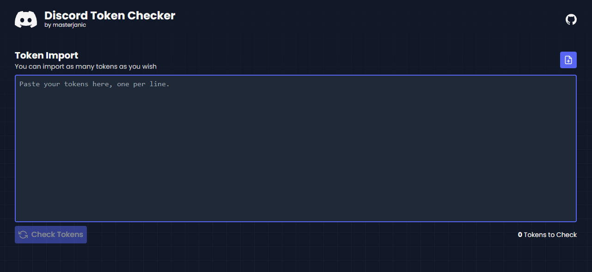
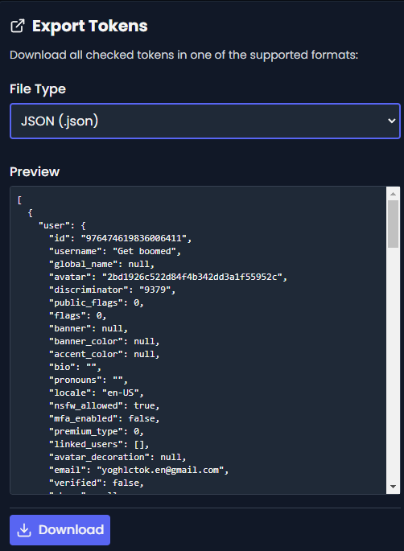
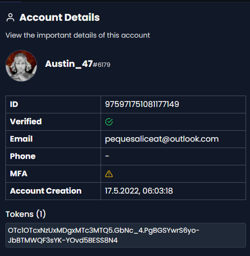

## 🔴 LIVE DEMO 
https://discord-checker.janic.dev

**DISCLAIMER:** This tool is for educational purposes only. I am not responsible for damages of any kind that are caused by using this tool.

## ❓ Information
This project is an open source tool which allows you to quickly check collected Discord tokens. You can easily export valid tokens and import text-like files containing tokens. 

## 💻 Features
- Load Discord tokens via file import or paste them into the checker
- Automatic removal of duplicated tokens
- Check for verified accounts, including badges and other account information
- Download valid tokens in various formats

❗ **Supports newest Discord token format**

## 📷 Preview 

## 🔨 How to build and host yourself
This project is built with the [Next.js](https://nextjs.org/) framework and requires Node.js to run.

To deploy your build please refer to the Next.js [deployment documentation](https://nextjs.org/docs/app/building-your-application/deploying).

## 📝 Contact
- **Discord:** @masterjanic